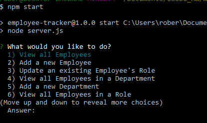

# Employee Tracker

## Description
Command line app to help keep track of employees and their job related info.

## Table of Contents
- [Description](description)
- [Installation](Installation)
- [Usage](Usage)

## Installation
After you clone this repo, before the first time you run the app, you will need to use the data in the `mysql` folder to create the data base. There is also some seed data you can feel free to use or any of your own! Once the data base has been made, go into the `server.js` file and on line 8 put your mysql password in for your local server. After the data base has been made, and your password added to the `server.js` file, you can go to your terminal and run `npm i`. Now you're ready to run command `npm start` and use the app!

## Usage
Once you've run the `npm start` command, you will be prompted by 8 options:

1. **View all Employees** : The app will display a table with all Employee info.

2. **Add a new Employee** : Follow the prompts to fill in the Employee's first and last name, then choose which Department they will be in.

3. **Update an existing Employee's Role** : Choose which Employee you want to update, then choose which Role you would like the Employee to be moved to.

4. **View all Employees in a Department** : The app will ask which Department you'd like to see, then will display a table with all Employees in the Department you chose.

5. **Add a new Department** : You will be prompted to fill in the name of the Department you'd like to add, and will add that Department once you press enter.

6. **View all Employees in a Role** : The app will ask which Role you'd like to see, then will display a table with all Employees in the Role you chose.

7. **Add a new Role** : The app will prompt you to enter the title of the new Role you'd like to add, will then ask you to input the wage for that Role. Afterwards it will ask which Department you'd like to add the new Role to.

8. **End** : Will close out the app.

[Demo Video](https://youtu.be/nzGJAwBC2E4)

### Thank You